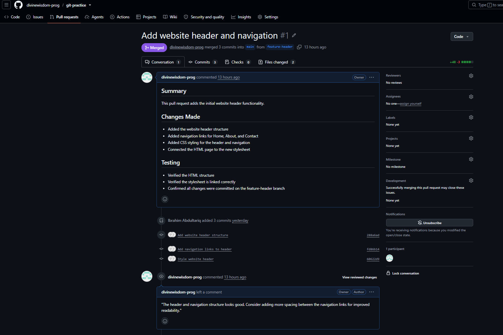
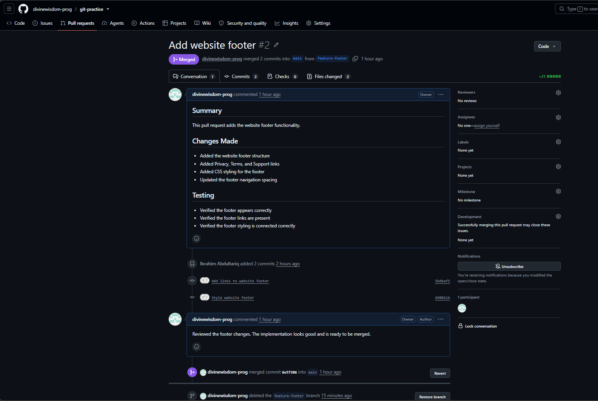

# Frontend Version Control Task

## Overview

This repository demonstrates my understanding of Git and GitHub version control workflows.

The project covers:

- Repository management
- Branching
- Commits
- Pull Requests
- Code review
- Merging
- Reverting commits
- Branch renaming
- Fetching remote updates

---

## Branches

### `main`
The main branch containing the completed and merged project.

### `feature-header`
Used to develop the website header and navigation.

**Commits:**
1. `Add website header structure`
2. `Add navigation links to header`
3. `Style website header`

The branch was reviewed and merged into `main` through a Pull Request.

### `feature-footer-complete`
Originally created as `feature-footer` to develop the website footer.

**Commits:**
1. `Add website footer structure`
2. `Add links to website footer`
3. `Style website footer`

The branch was reviewed and merged into `main`, then renamed to `feature-footer-complete` to demonstrate branch renaming.

---

## Pull Requests

### Pull Request 1 — Add Website Header and Navigation

Added:

- Website header
- Navigation links
- Header styling

The Pull Request was reviewed and merged into `main`.

### Pull Request 2 — Add Website Footer

Added:

- Website footer
- Footer navigation links
- Footer styling

The Pull Request was reviewed and merged into `main`.

---

## Pull Request Screenshots

### Feature Header PR



### Feature Footer PR



---

## Git Commands Used

| Command | Purpose |
|---|---|
| `git init` | Initialize a Git repository |
| `git status` | Check the current repository status |
| `git diff` | View changes |
| `git add` | Stage changes |
| `git commit` | Save changes to Git history |
| `git log` | View commit history |
| `git branch` | View branches |
| `git switch` | Switch branches |
| `git branch -m` | Rename a branch |
| `git push` | Upload changes to GitHub |
| `git pull` | Download and integrate remote changes |
| `git fetch` | Retrieve remote updates |
| `git revert` | Safely undo a previous commit |

---

## Reversion

A minor error was intentionally introduced through the commit:

`Update website title`

The commit was reverted using:

```bash
git revert <commit-hash>

This demonstrated that git revert creates a new commit that reverses the changes while preserving the original commit in the project history.

Branch Renaming

The feature-footer branch was renamed to:

feature-footer-complete

The updated remote branches were verified using:

git fetch --prune
git branch -r

The final remote branches included:

origin/main
origin/feature-header
origin/feature-footer-complete
Lessons Learned

Through this task, I learned how Git and GitHub are used to manage and collaborate on software projects.

Key lessons include:

Git tracks changes to a project over time.
Commits provide a history of changes.
Branches allow developers to work on features independently.
Pull Requests allow changes to be reviewed before merging.
GitHub provides remote repository hosting and collaboration features.
git revert can safely undo a commit without deleting its history.
Branches can be renamed and synchronized with remote repositories.
Meaningful commit messages make project history easier to understand.
   
   
Conclusion

This project gave me practical experience with the Git and GitHub workflow, from creating branches and commits to creating Pull Requests, reviewing and merging changes, reverting commits, and managing remote branches.